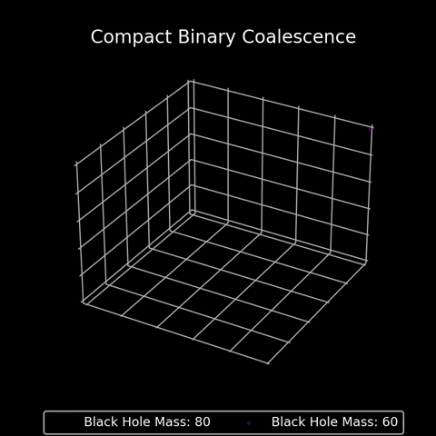
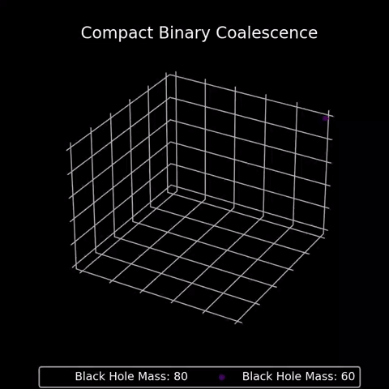
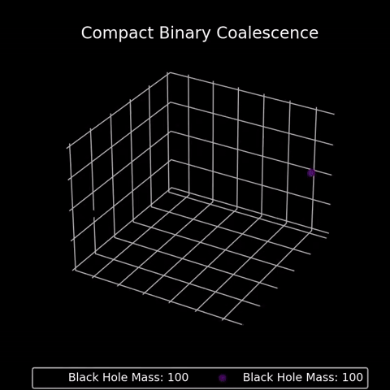
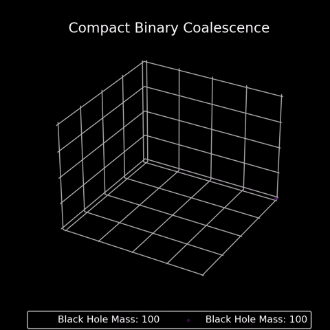

# CBC-Simulation

## WIP 

This project is a work in progress

## Demo

In order for a compact binary to coalesce, gravitational wave emission allows the system to lose energy and a merger to proceed.
In this demo we can see the result of null energy loss for each compact object, thus not resulting in a merger.

## Example 1:

If we cause the compact objects to lose kinetic energy through the emission of gravitational waves our demo becomes:

## Example 2:

Again, if we apply the physics of gravitational wave emission we can see the inspiral of the mergering compact objects:

