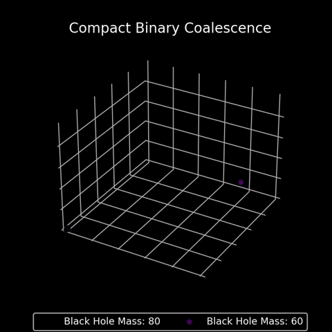
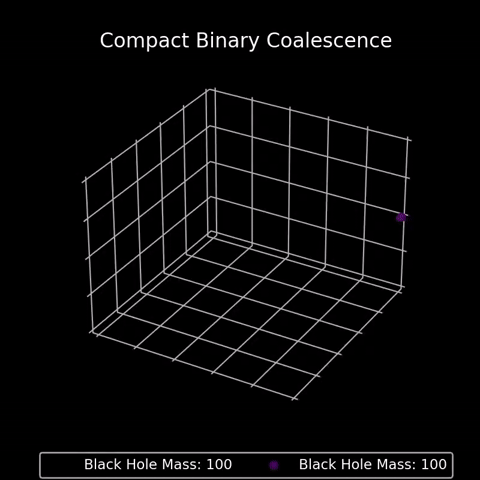

# CBC-Simulation

- [Introduction](#introduction)
- [Demos](#demos)
  - [Example 1](#example-1)
  - [Example 2 Parallel](#example-2-parallel)
  - [Example 3 Spiral](#example-3-spiral)
- [Technical Features](#technical-features)
- 

## Introduction

CBC-Simulation attempts to simulate a compact binary coalescence. The methodology uses classical mechanics to simulate the inspiral part of the inspiral-merger-ringdown nature of a CBC. 

The current state of this project is just the inspiral. Future work will include attempting to use relativity to model the merger and ringdown sections.

## Demos

In order for a compact binary to coalesce, gravitational wave emission allows the system to lose energy and a merger to proceed.
In this demo we can see the result of null energy loss for each compact object, thus not resulting in a merger.

### Example 1:

If we cause the compact objects to lose kinetic energy through the emission of gravitational waves our demo becomes:

### Example 2 Parallel:

Again, if we apply the physics of gravitational wave emission we can see the inspiral of the merging compact objects:

### Example 3 Spiral:

Setting the compact objects to be in orbit around the centre of mass in the system allows for a greater amount of spirals compared to other tests. This figure shows the merger of two objects that spiral in towards each other due to the emission of gravitational waves.

## Technical Features

- **Multiprocessing**: The `multiprocessing` module is utilised to improve performance and efficiency, especially in generating animation frames. By dividing the work among multiple CPU cores, the rendering process is significantly accelerated.

- **3D Visualisation**: The simulation employs `matplotlib` for 3D scatter plot animations, offering a dynamic and detailed visualisation of the coalescence process.

- **Energy Loss Simulation**: The model incorporates physics principles to simulate energy loss due to gravitational wave emission, essential in replicating the inspiral phase of compact binary coalescence.

- **GPU-Accelerated Video Rendering**: For compiling the generated frames into a smooth animation, the script employs `FFmpeg` with GPU acceleration (specifically for NVIDIA GPUs), ensuring rapid and high-quality video production.

- **Dynamic Simulation Parameters**: The script is designed to adjust various parameters like object separation and kinetic energy loss, allowing for diverse simulation scenarios.

- **Efficient Memory Management**: To manage system resources effectively, the script saves temporary files to drive storage rather than using all the systems memory. After processing, the temporary files are removed.

## License
[License](LICENSE)

## [Back To Top](#CBC-Simulation)